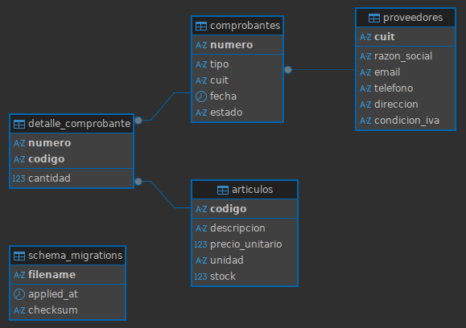

# Entrega Grupo 4 - Taller ARI

Integrantes: 
- Ezequiel Salgado Salevsky - 650/20
- Joaquín Paris Puebla - 1311/23

Partimos de aida26b, una app de gestion de alumnos, y la adaptamos a un sistema con proveedores, artículos y comprobantes. 
La app de la cátedra ya segúia la idea de SSOT, el structure.ts se encarga de esto, declara las tablas, columnas, relaciones y permisos, y a partir de eso tenemos los CRUDs, la validación y el frontend. Entendemos que esto era parte de la consigna pero lo aclaramos para que se entienda que el espíritu del trabajo de la entrega era expandir este modelo ssot pero adaptado a otro modelo.

## Modelo de dominio

Modelamos 4 tablas:

- proveedores: emisores del comprobante (PK: cuit)
- articulos: ítems facturables (PK: codigo, con precio_unitario).
- comprobantes:la factura (PK: numero, FK a proveedores.cuit)
- detalle_comprobante: ítems de línea, relación 1→N: un comprobante contiene muchos artículos con su cantidad' (PK compuesta por numero + codigo, ON DELETE CASCADE).

Como partimos del proyecto de alumnos, las tablas viejas (students, subjects, enrollments) quedaban en la base aunque el ssot ya no las declara. Las dropeamos con una migracion que además saca la FK muerta de auth.users a students. El esquema final queda solo con el dominio nuevo:

## Flujo de creacion de un comprobante

El caso de uso que guió el diseño fue el de dar de alta un comprobante a partir de un proveedor y sus artículos:

1. Elegir proveedor: El comprobante referencia por FK a 'proveedores.cuit', la db garantiza que no se pueda facturar a un proveedor inexistente.

2. Elegir artículos y cantidades: Cada línea del detalle referencia a 'articulos.codigo' con una 'cantidad' (CHECK (cantidad > 0)).

3. Crear todo en una sola operación atómica: El endpoint /api/comprobantes/with-items inserta el comprobante y todas sus líneas dentro de una única transacción. Si una línea falla, se revierte todo y así nunca queda un comprobante huerfano sin detalle. 
Es genérico —lo maneja la relación `detailOf` del SSOT—, así que sirve para cualquier par padre/detalle, no solo comprobantes.

4. El total no se ingresa: se deriva. Eliminamos la columna 'total' guardada. Ahora se calcula como 'SUM(cantidad * precio_unitario)' sobre el detalle. Como la fóRmula vive en el ssot, el total es siempre coheremte.

## Features que agregamos

La idea general es que solo agregamos SQL donde el motor genérico no llega: todo lo demás lo sigue generando el SSOT. Las 4 migraciones nuevas son porque el esquema físico del dominio es lo único que no se puede derivar
del ssot y hay que crearlo; cada una lleva un comentario de una línea con su motivo.

### 1. Creación atómica padre + detalle 
Ver: with_items.ts. Da de alta el comprobante y todas sus líneas de detalle 
en una sola operación. Lo hacemos así para que nunca quede un comprobante huérfano sin detalle: si falla una línea, se revierte todo. 
Es genérico (lo maneja la relación detailOf del ssot), así que sirve para cualquier par padre/detalle, no solo comprobantes.
Los INSERT van dentro de una transacción explícita (BEGIn/COMMIT/ROLLBACK), porque el motor genérico inserta una fila por request 
y acá necesitamos atomicidad entre varias. Ver migración 'detalle_comprobante' (relación 1:N con ON DELETE CASCADE).

### 2. Reportes mensuales genéricos  
Ver: report.ts. Agrega datos por mes sobre cualquier tabla: agrupa por una o más columnas, cuenta las filas de cada grupo y, si se le pasa una columna numérica, la suma (x ejemplo el total de los comprobantes). Lo hicimos genérico y manejado por la metadata del ssot, en lugar de un endpoint hardcodeado por reporte, para poder sumar reportes nuevos solo declarándolos.
Acá escribimos a mano una query que agrupa y suma, porque el CRUD sabe listar filas pero no totalizarlas. Los nombres de columna que llegan por parámetro solo se aceptan si están en la whitelist de columnas reales de la tabla (sale del ssot); cualquier otra cosa se rechaza, así no se cuela un nombre inventado dentro del SQL. Los filtros los reusa del helper filter_ de get.ts, que arma los WHERE según lo que elige el usuario

### 3. Columnas derivadas
Ver: sqlGenerationStatement en structure.ts. Valores calculados por SQL que se declaran en el ssot, como el total del comprobante (SUM(cantidad * precio_unitario)) o el subtotal de cada línea. Lo resolvimos así para que el total no se pueda desincronizar de las líneas: no es un campo que se ingresa, es una fórmula.
El subquery del total no es SQL suelto, vive declarado como fórmula de la columna en el ssot. Y como el total dejó de guardarse, la migración 'comprobante_total_derived' hace el DROP COLUMN total.

### 4. RBAC de tres niveles
Ver: access en structure.ts (canRoleDo) y access por reporte (canRoleRunReport). Cada tabla declara en el ssot quién puede hacer read/create/update/delete, y cada reporte declara quién puede correrlo; esas mismas declaraciones las usan el backend y el frontend.
Hay tres niveles: admin (puede todo), administrativo (ve y agrega proveedores/artículos/comprobantes, sin editar/borrar y sin reportes) y contador (solo genera reportes, sin acceso a las tablas). El acceso a reportes se declara aparte del read de tabla, para poder darle reportes al contador sin darle las tablas y datos al administrativo sin darle reportes. Lo pusimos en el ssot para tener una única fuente de permisos, sin reglas duplicadas entre front y back. Acá no tocamos SQL: se resuelve en la capa de aplicación a partir del ssot.

El SQL del CRUD base (post/put/delete y el SELECT/JOIN de get) no se modificó: lo sigue generando el motor a partir del ssot.